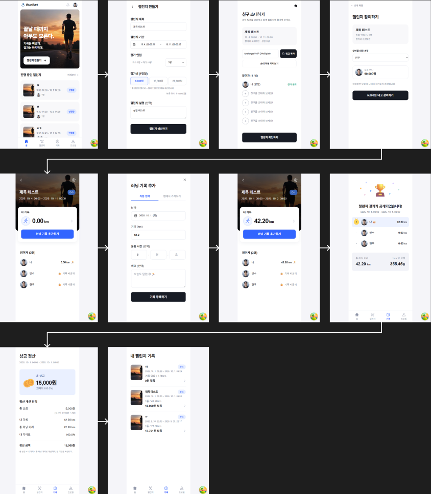

## 필수 작성 항목

## 프로젝트 소개

```markdown
## runbet

- 프로젝트 이름 : runbet
- 프로젝트 주제 : 러닝 챌린지
- 서비스 한 줄 소개 : 같은 참가비를 걸고 달린 거리만큼 상금을 나눠 가져, 더 많이 달리고 싶게 만드는 러닝 챌린지 서비스입니다.
- 주요 사용자 : 러닝을 꾸준히 이어가며 더 많은 마일리지를 쌓고 싶은 사람들
- 개발 기간 : 2026.09.28 - 2026.10.02
```

## 주요 기능

- 진행 중인 러닝 챌린지와 전체 챌린지 목록을 조회할 수 있습니다.
- 제목, 기간, 최대 참가 인원, 참가비, 설명을 입력해 챌린지를 만들 수 있습니다.
- 초대 링크를 복사해 공유하고, 초대 화면에서 참가 현황을 확인할 수 있습니다.
- 데모 사용자를 선택해 챌린지에 참가할 수 있습니다. 참가 시 정원, 중복 참가 여부, 챌린지 시작 여부와 잔액을 확인합니다.
- 챌린지 기간 중 날짜, 달린 거리, 운동 시간, 메모를 러닝 기록으로 등록할 수 있습니다.
- 참가자 목록, 개인 기록, 기록 달력과 주간 기록을 확인할 수 있습니다.
- 종료된 챌린지의 참가자 순위와 참가비 정산 결과를 확인할 수 있습니다.

| 기능               | 주소                                                         | 설명                                             |
| ------------------ | ------------------------------------------------------------ | ------------------------------------------------ |
| 홈 및 진행 중 목록 | `/`                                                          | 진행 중인 챌린지를 확인합니다.                   |
| 전체 챌린지 목록   | `/challenges/lists`                                          | 챌린지 목록을 확인합니다.                        |
| 챌린지 생성        | `/challenges/new`                                            | 챌린지 정보와 참가 조건을 입력합니다.            |
| 초대 및 참가       | `/challenges/[id]/invite`, `/challenges/[id]/join`           | 초대 링크를 복사하거나 데모 사용자로 참가합니다. |
| 챌린지 기록        | `/challenges/[id]/records`, `/challenges/[id]/records/new`   | 기록 목록을 확인하고 러닝 기록을 등록합니다.     |
| 참가자 및 달력     | `/challenges/[id]/participants`, `/challenges/[id]/calendar` | 참가자 목록과 기록 달력을 확인합니다.            |
| 결과 및 정산       | `/challenges/[id]/results`, `/challenges/[id]/settlement`    | 챌린지 순위와 참가비 정산 결과를 확인합니다.     |

## 화면 구성

### 와이어 프레임



### 홈 화면

진행 중인 챌린지 목록으로 이동할 수 있는 홈 화면을 구성했습니다.

### 챌린지 생성 화면

제목, 기간, 참가 인원, 참가비와 설명을 입력할 수 있습니다.

## 기술 스택

- Next.js (App Router)
- React
- TypeScript
- Tailwind CSS
- Axios
- TanStack Query
- JSON Server

## 설치 및 실행 방법

### 1. 저장소 복제

```bash
git clone https://github.com/woong3e/sesacsaltlux_firstproject_runbet
```

### 2. 프로젝트 폴더로 이동

```bash
cd sesacsaltlux_firstproject_runbet
```

### 3. 패키지 설치

```bash
npm install
```

### 4. JSON Server 실행

```bash
npm run server
```

### 5. Next.js 실행

새 터미널에서 실행합니다.

```bash
npm run dev
```

- Next.js: http://localhost:3000
- JSON Server: http://localhost:9999

JSON Server와 Next.js는 각각 실행되어야 하므로 서로 다른 터미널에서 실행합니다.

## 폴더 구조

```text
src/
├─ app/          # 페이지와 App Router 경로
├─ components/   # 화면별 및 공통 UI 컴포넌트
├─ hooks/        # 재사용하는 React Hook
├─ lib/          # API 요청과 챌린지 관련 유틸리티
└─ types/        # 공유 TypeScript 타입
docs/
└─ design/       # UI 디자인 참고 이미지
public/          # 정적 파일
db.json          # JSON Server 데이터
```

## 주요 컴포넌트

| 컴포넌트              | 역할                                                                      |
| --------------------- | ------------------------------------------------------------------------- |
| `ChallengeList`       | 챌린지를 조회해 진행 중인 목록을 표시하고 로딩 및 오류 상태를 처리합니다. |
| `ChallengeCard`       | 챌린지 제목, 기간, 참가 현황 등 목록 항목을 표시합니다.                   |
| `CreateChallengeForm` | 챌린지 생성 정보를 입력받고 생성 후 초대 화면으로 이동합니다.             |
| `InviteChallenge`     | 초대 링크 복사와 참가 현황 표시를 담당합니다.                             |
| `JoinChallenge`       | 데모 참가자를 선택하고 챌린지 참가를 처리합니다.                          |
| `ParticipantList`     | 챌린지 참가자와 각 참가자의 기본 정보를 표시합니다.                       |
| `ChallengeDashboard`  | 챌린지의 요약 정보와 기록·참가자 화면 진입을 제공합니다.                  |

## 상태 관리

- 챌린지와 사용자 데이터 조회에는 TanStack Query의 `useQuery`를 사용합니다.
- 챌린지 생성, 참가, 기록 등록처럼 데이터를 변경하는 작업에는 `useMutation`을 사용합니다.
- 생성 폼과 초대 링크 복사 상태처럼 한 화면에서 사용하는 입력 상태는 해당 컴포넌트의 `useState`로 관리합니다.
- API 요청은 Axios 인스턴스를 사용하는 `src/lib/api/` 함수에 모았습니다.
- 챌린지와 사용자 데이터는 `db.json`에 저장합니다.

## 프로젝트 회고 초안

- tanstack query 사용에 익숙하지 않았는데 프로젝트를 진행하며 useQuery, useMutation, useQueryClient를 사용해보면서 동작 흐름을 이해할 수 있었습니다.
- codex의 빠릿함에 놀랐고 코드를 직관적으로 빠르게 읽을 수 있는 능력이 중요하지 않을까 라는 생각이 들었습니다.
